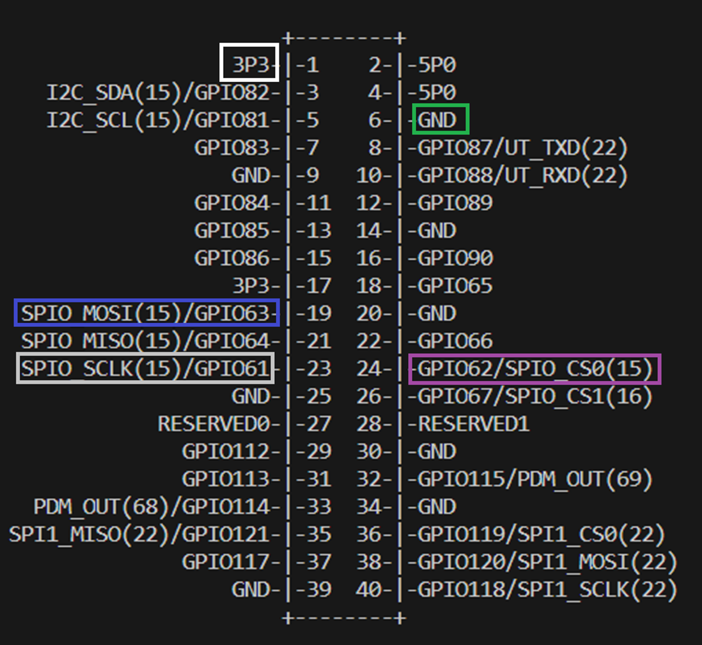
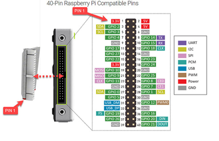
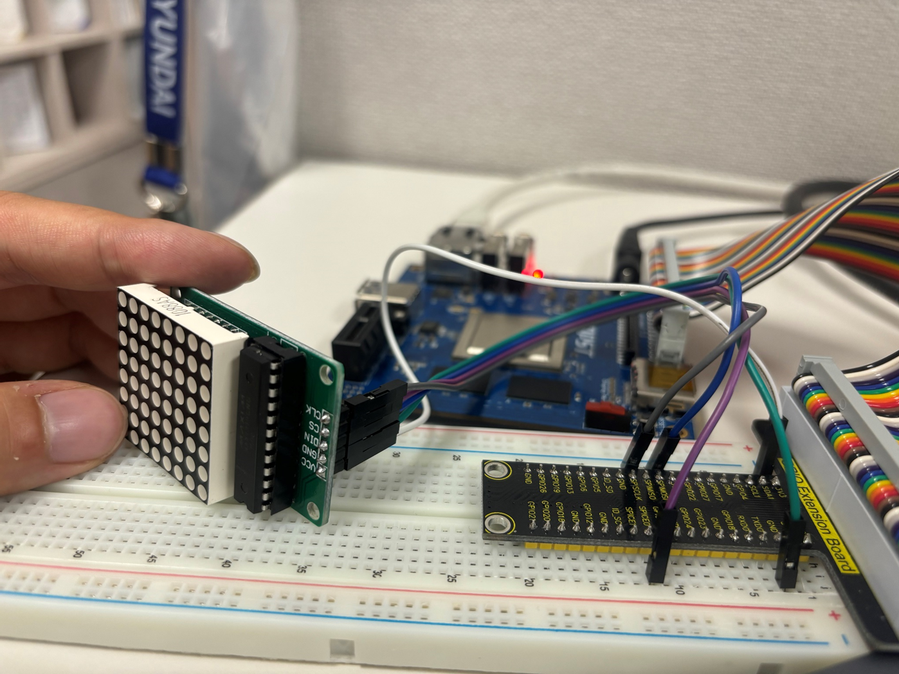

#04-spi-dot-matrix-control


## Getting started

## SPI - Dot Matrix Control

### 1) Select GPIO PIN for control Dot Matrix (EB – Extension Board)
###    - Data IN: 63 / EB : SPIMOSI
###    - Clock : 61 / EB : SPISCLK
###    - CS0 : 62 / EB : SPICE0





### 2) Connect TOPST D3 & 8x8 Dot Matrix




## spi test code
cd spi-test
make 
<pre>
./spi_test -d /dev/spidev0.0 -l 2 -m 0b07 -s 200000
./spi_test -d /dev/spidev0.0 -l 2 -m 0a0f -s 200000
./spi_test -d /dev/spidev0.0 -l 2 -m 0900 -s 200000
</pre>

## Code
```
/**
 * @file spi_test.c
 *
 * Simple spidev testing program.
 * @author Michael Welling <mwelling@ieee.org>
 *
 * Copyright (C) 2015 QWERTY Embedded Design
 *
 * Based on a similar utility written for EMAC Inc. SPI class.
 *
 * Copyright (C) 2009 EMAC, Inc.
 */
/***************************************************************************
 *                                                                         *
 *   This program is free software; you can redistribute it and/or modify  *
 *   it under the terms of the GNU General Public License as published by  *
 *   the Free Software Foundation; either version 2 of the License, or     *
 *   (at your option) any later version.                                   *
 *                                                                         *
 ***************************************************************************/

#include <string.h>
#include <fcntl.h>
#include <stdio.h>
#include <errno.h>
#include <getopt.h>
#include <sys/ioctl.h>
#include <sys/param.h>
#include <linux/spi/spidev.h>

#define MAX_LENGTH 64

__u8 char2hex(char value)
{
        __u8 retval;

        if (value >= '0' && value <= '9')
                retval = value - '0';
        else if (value >= 'A' && value <= 'F')
                retval = value - 'A' + 0xA;
        else if (value >= 'a' && value <= 'f')
                retval = value - 'a' + 0xA;
        else
                retval = 0xF;

        return retval;
}

void string2hex(char *str, __u8 *hex, int length)
{
        int i;
        __u8 nibble;

        for (i = 0; i < (length * 2); i++) {
                if (i < strlen(str))
                        nibble = char2hex(str[i]);
                else
                        nibble = 0xf;
                if (i % 2 == 0)
                        hex[i / 2] = nibble;
                else
                        hex[i / 2] = (hex[i / 2] << 4) | nibble;
        }
}

void print_spi_transaction(__u8 *miso, __u8 *mosi, __u32 length)
{
        int i;

        printf("MOSI  MISO\n");
        for (i = 0; i < length; i++)
                printf("%.2X  : %.2X\n", mosi[i], miso[i]);
}

void print_usage(void)
{
        printf("USAGE: spi_test -d dev -l len -m mosi -s speed\n"
               "      -d,--device dev: name of the spi device node\n"
               "      -l,--length len: length of spi transaction(bytes)\n"
               "      -m,--mosi mosi: hex value to be transmitted\n"
               "      -s,--speed speed: speed of the transaction in Hz\n\n"
               "EX: spi_test -d /dev/spidev0.0 -l 4 -m 12AB\n\n"
               "Note: mosi will be padded or truncated\n"
               "      to the length speficied.\n"
               "      %d bytes maximum length.\n", MAX_LENGTH);
}


int main(int argc, char *argv[])
{
        __u8 miso[MAX_LENGTH];
        __u8 mosi[MAX_LENGTH];
        struct spi_ioc_transfer tr = {
                .tx_buf = (unsigned long)mosi,
                .rx_buf = (unsigned long)miso,
                .delay_usecs = 1,
                .len = 1,
        };
        char *device_name = NULL;
        char *mosi_str = "FF";
        int opt_i = 0;
        int c;
        int fd;
        int ret;

        static struct option long_opts[] = {
                { "device", required_argument, 0, 'd' },
                { "length", required_argument, 0, 'l' },
                { "mosi", required_argument, 0, 'm' },
                { "speed", required_argument, 0, 's' },
                { "help", no_argument, 0, '?' },
                { 0, 0, 0, 0 },
        };

        while ((c = getopt_long(argc, argv, "d:l:m:s:?",
                                long_opts, &opt_i)) != -1) {
                switch (c) {
                case 'd':
                        device_name = optarg;
                        break;
                case 'l':
                        tr.len = MIN(atoi(optarg), MAX_LENGTH);
                        break;
                case 'm':
                        mosi_str = optarg;
                        break;
                case 's':
                        tr.speed_hz = atoi(optarg);
                        break;
                case '?':
                        print_usage();
                        return 0;
                }
        }

        if (!device_name) {
                fprintf(stderr, "Missing required device argument.\n");
                print_usage();
                return -1;
        }

        fd = open(device_name, O_RDWR);
        if (fd == -1) {
                fprintf(stderr, "main: opening device file: %s: %s\n",
                       device_name, strerror(errno));
                return -1;
        }

        string2hex(mosi_str, mosi, tr.len);

        printf("Sending to %s at %ld Hz\n", device_name, tr.speed_hz);

        ret = ioctl(fd, SPI_IOC_MESSAGE(1), &tr);
        if (ret == -1)
                fprintf(stderr, "main: ioctl SPI_IOC_MESSAGE: %s: %s\n",
                        device_name, strerror(errno));
        else
                print_spi_transaction(miso, mosi, tr.len);

        close(fd);

        return ret;
}
```


## Installation

- [ ] pip3 install

```
sudo apt-get install python-pip3
```

- [ ] module install

```
pip3 install luma

pip3 install luma.led_matrix
```

## Run

```
cd dot-matrix-using-spi

python3 matrix_sign.py
```

## Code
```
#!/usr/bin/env python
# -*- coding: utf-8 -*-
# Copyright (c) 2017-18 Richard Hull and contributors
# See LICENSE.rst for details.

import re
import time
import argparse

from luma.led_matrix.device import max7219
from luma.core.interface.serial import spi, noop
from luma.core.render import canvas
from luma.core.virtual import viewport
from luma.core.legacy import text, show_message
from luma.core.legacy.font import proportional, CP437_FONT, TINY_FONT, SINCLAIR_FONT, LCD_FONT


def demo(n, block_orientation, rotate, inreverse):
    # create matrix device
    serial = spi(port=0, device=0, gpio=noop())
    device = max7219(serial, cascaded=n or 1, block_orientation=block_orientation,
                     rotate=rotate or 0, blocks_arranged_in_reverse_order=inreverse)
    print("Created device")
    
    # start demo
    msg = "I love you arin"
    print(msg)
    for x in range(3):
        show_message(device, msg, fill="white", font=proportional(CP437_FONT), scroll_delay=0.1)
        show_message(device, msg, fill="white", font=proportional(TINY_FONT), scroll_delay=0.2)
        show_message(device, msg, fill="white", font=proportional(SINCLAIR_FONT), scroll_delay=0.3)
        show_message(device, msg, fill="white", font=proportional(LCD_FONT), scroll_delay=0.4)
    

if __name__ == "__main__":
    parser = argparse.ArgumentParser(description='matrix_demo arguments',
        formatter_class=argparse.ArgumentDefaultsHelpFormatter)

    parser.add_argument('--cascaded', '-n', type=int, default=1, help='Number of cascaded MAX7219 LED matrices')
    parser.add_argument('--block-orientation', type=int, default=0, choices=[0, 90, -90], help='Corrects block orientation when wired vertically')
    parser.add_argument('--rotate', type=int, default=0, choices=[0, 1, 2, 3], help='Rotate display 0=0°, 1=90°, 2=180°, 3=270°')
    parser.add_argument('--reverse-order', type=bool, default=False, help='Set to true if blocks are in reverse order')

    args = parser.parse_args()

    try:
        demo(args.cascaded, args.block_orientation, args.rotate, args.reverse_order)
    except KeyboardInterrupt:
        pass

```
## Result 1


## Insatll and Run luma.led_matrix

```
pip install luma.led_matrix

python3 luma.led_matrix/max7219/examples/matrix_demo.py
```

## Result 2


